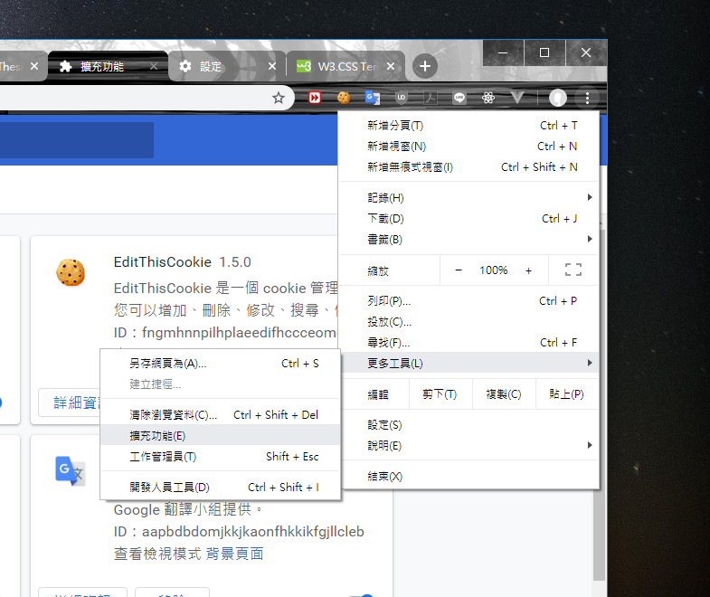

## Google Chrome Extension - Web Extractor

1. 打開Chrome瀏覽器 > 更多工具 > 擴充功能

2. 載入未封裝項目 > 選取Chrome Extractor資料夾
3. 打開測試頁面 > 點擊萃取工具圖示
---
1. Open Chrome Browser > More tools >  Extensions
2. Load unpacked > choose Chrome Extractor folder 
3. Open test web page and click extactor icon.
